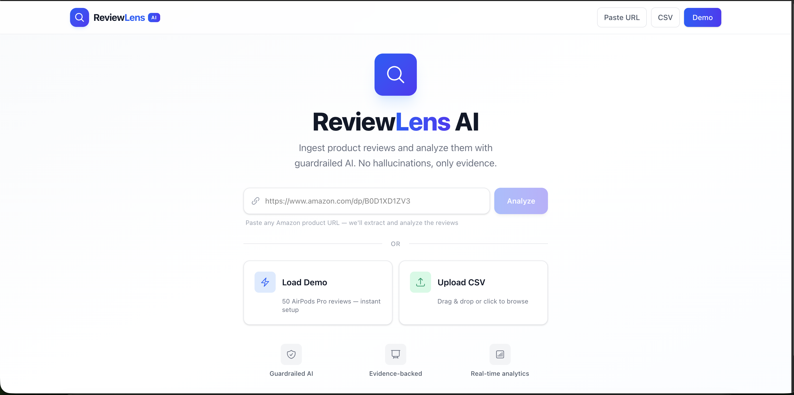
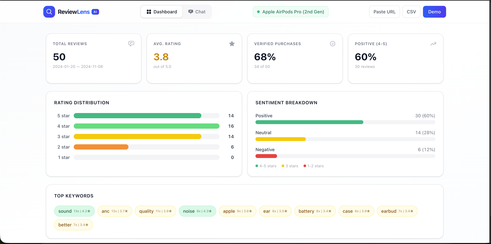
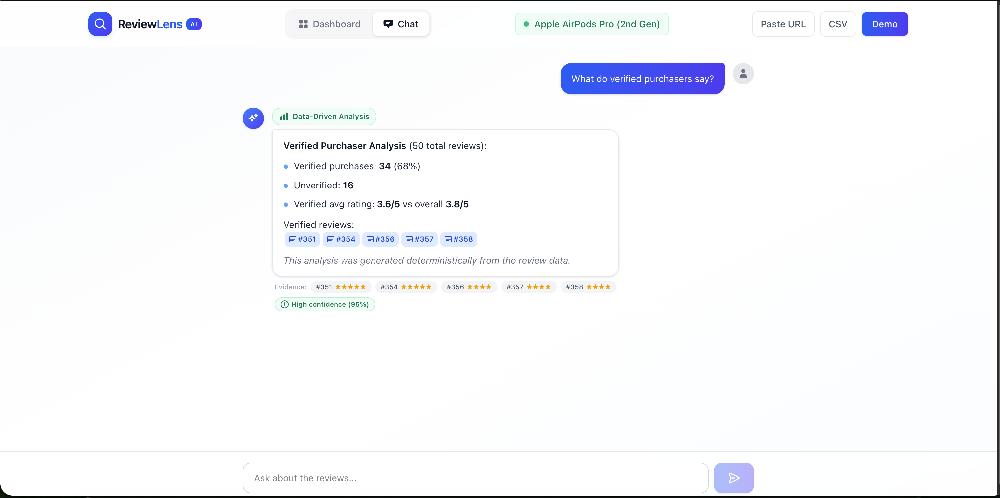
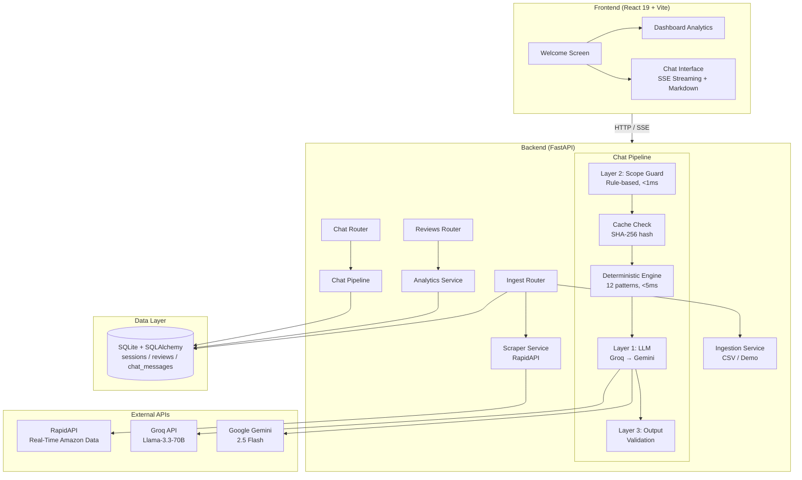

# ReviewLens AI

> **Review Intelligence Portal** — Ingest product reviews from Amazon, CSV, or demo data and analyze them through a guardrailed AI chat interface. Zero hallucinations, only evidence.

Built as a Take-Home Assignment.

[](https://review-lens-ai-pi.vercel.app/)
[](https://reviewlens-api-n9kw.onrender.com)
[](#test-suite)
[](#test-suite)
[](#tech-stack)
[](#tech-stack)

---

## Preview

<p align="center">
  
</p>
<p align="center"><em>Welcome Screen — Paste an Amazon URL, upload CSV, or load demo data instantly</em></p>

<p align="center">
  
</p>
<p align="center"><em>Dashboard — Stat cards, star distribution, sentiment breakdown, keyword cloud, review browser</em></p>

<p align="center">
  
</p>
<p align="center"><em>AI Chat — SSE streaming, citation badges, confidence scoring, scope guard in action</em></p>

---

## Why This Build Stands Out

- **Strictly guardrailed Q&A:** Answers stay inside ingested review evidence — 188 tests enforce this.
- **Evidence-first output:** Every key claim links back to a specific `[Review #N]` citation.
- **4-level failover:** Scope Guard → Cache → Deterministic Engine → Groq LLM → Gemini LLM → Data Summary. The app **never** shows a blank error.
- **Zero cost:** Entire stack runs on free tiers (Groq, Gemini, Vercel, Render).

---

## Table of Contents

- [Preview](#preview)
- [Live Demo](#live-demo)
- [Assumptions & Constraints](#assumptions--constraints)
- [Quick Start](#quick-start)
- [Architecture Overview](#architecture-overview)
- [Three-Layer Scope Guard](#three-layer-scope-guard)
- [Tech Stack](#tech-stack)
- [User Flow Diagram](#user-flow-diagram)
- [Data Flow Diagram](#data-flow-diagram)
- [API Reference](#api-reference)
- [Error Handling](#error-handling)
- [Frontend Components](#frontend-components)
- [LLM Strategy](#llm-strategy)
- [Test Suite](#test-suite)
- [Project Structure](#project-structure)
- [Design Decisions](#design-decisions)
- [Future Enhancements](#future-enhancements)
- [Contributing](#contributing)
- [License](#license)

---

## Live Demo

| Service      | URL                                           |
| ------------ | --------------------------------------------- |
| Frontend     | https://review-lens-ai-pi.vercel.app/         |
| Backend API  | https://reviewlens-api-n9kw.onrender.com      |
| Swagger Docs | https://reviewlens-api-n9kw.onrender.com/docs |

> **Quick demo:** Click **"Load Demo"** on the welcome screen to instantly load 50 curated AirPods Pro reviews and start analyzing. No API keys needed.

> **Note:** The Render free tier sleeps after 15 minutes of inactivity. The first request may take ~30s to wake the server.

---

## Assumptions & Constraints

These assumptions shaped every design decision in this project. They're listed upfront so evaluators understand the scope boundaries before diving into the architecture.

| Assumption | Rationale |
| --- | --- |
| Amazon is the primary review platform | Universal familiarity, richest data structure (ratings, verified purchase, helpful votes) |
| URL ingestion uses RapidAPI exclusively | Reliable, structured API. CSV upload and demo data serve as fallbacks when scraping is impractical or API keys are unavailable |
| Session-scoped SQLite is sufficient | Prototype doesn't need cross-session persistence. Zero-config for evaluators — no database setup required |
| No user authentication | Prototype scope. Rate limiting by IP is sufficient without user accounts |
| Zero financial cost | Entire stack runs on free tiers: Groq (LLM), Gemini (fallback LLM), Vercel (frontend), Render (backend) |
| Pre-loaded demo dataset (50 reviews) | Included for frictionless evaluation without requiring any API keys |

---

## Quick Start

### Prerequisites

- Python 3.11+
- Node.js 20+
- npm 9+

### 1. Clone & Setup Backend

```bash
git clone https://github.com/Shams261/ReviewLens-AI.git
cd ReviewLens-AI/backend

python3 -m venv venv
source venv/bin/activate          # Windows: venv\Scripts\activate
pip install -r requirements.txt

cp .env.example .env              # Add your API keys
uvicorn app.main:app --reload --port 8000
```

### 2. Setup Frontend

```bash
cd frontend
npm install
npm run dev
```

### 3. Verify

```bash
# Backend health check
curl http://localhost:8000/api/health

# Frontend
open http://localhost:5173
```

### Environment Variables

| Variable         | Required          | Purpose                                    |
| ---------------- | ----------------- | ------------------------------------------ |
| `GROQ_API_KEY`   | Yes               | Primary LLM (Llama-3.3-70B via Groq)      |
| `GEMINI_API_KEY` | Yes               | Fallback LLM (Gemini 2.5 Flash)           |
| `RAPIDAPI_KEY`   | For URL ingestion | Amazon review scraping via RapidAPI        |
| `CORS_ORIGINS`   | No                | Allowed origins (default: localhost:5173)  |

> Without `RAPIDAPI_KEY`, URL ingestion is disabled — CSV upload and demo data still work fully.

---

## Architecture Overview



<details>
<summary><strong>ASCII Version</strong> (for terminals / non-GitHub viewers)</summary>

```
┌─────────────────────────────────────────────────────────────────────┐
│                        FRONTEND (React SPA)                        │
│  ┌──────────┐   ┌──────────────┐   ┌──────────────────────────┐   │
│  │ Welcome  │──>│  Dashboard   │   │     Chat Interface       │   │
│  │ Screen   │   │  Analytics   │   │  SSE Streaming + Markdown│   │
│  └──────────┘   └──────────────┘   └──────────────────────────┘   │
│         Vite Dev Server (port 5173) — /api proxy to backend        │
└────────────────────────────┬────────────────────────────────────────┘
                             │ HTTP / SSE
┌────────────────────────────▼────────────────────────────────────────┐
│                        BACKEND (FastAPI)                            │
│                                                                     │
│  ┌──────────┐   ┌──────────┐   ┌──────────┐   ┌──────────────┐   │
│  │ Ingest   │   │ Reviews  │   │   Chat   │   │   Health     │   │
│  │ Router   │   │ Router   │   │  Router  │   │   Router     │   │
│  └────┬─────┘   └────┬─────┘   └────┬─────┘   └──────────────┘   │
│       │              │              │                               │
│  ┌────▼─────┐   ┌────▼─────┐   ┌───▼────────────────────────┐    │
│  │ Scraper  │   │Analytics │   │    Chat Pipeline            │    │
│  │ Service  │   │ Service  │   │                             │    │
│  ├──────────┤   └──────────┘   │  ┌─────────────────────┐   │    │
│  │Ingestion │                  │  │  Layer 2: Scope Guard│   │    │
│  │ Service  │                  │  │  (Rule-based, <1ms)  │   │    │
│  └────┬─────┘                  │  └──────────┬──────────┘   │    │
│       │                        │             │ pass          │    │
│       │                        │  ┌──────────▼──────────┐   │    │
│       │                        │  │  Cache Check        │   │    │
│       │                        │  │  (SHA-256 hash)     │   │    │
│       │                        │  └──────────┬──────────┘   │    │
│       │                        │             │ miss          │    │
│       │                        │  ┌──────────▼──────────┐   │    │
│       │                        │  │  Deterministic      │   │    │
│       │                        │  │  Engine (12 patterns)│  │    │
│       │                        │  └──────────┬──────────┘   │    │
│       │                        │             │ no match     │    │
│       │                        │  ┌──────────▼──────────┐   │    │
│       │                        │  │  Layer 1: LLM       │   │    │
│       │                        │  │  Groq → Gemini      │   │    │
│       │                        │  └──────────┬──────────┘   │    │
│       │                        │             │               │    │
│       │                        │  ┌──────────▼──────────┐   │    │
│       │                        │  │  Layer 3: Output    │   │    │
│       │                        │  │  Validation         │   │    │
│       │                        │  └─────────────────────┘   │    │
│       │                        └────────────────────────────┘    │
│  ┌────▼──────────────────────────────────────────────────────┐    │
│  │                   SQLite + SQLAlchemy                      │    │
│  │   sessions  │  reviews  │  chat_messages                  │    │
│  └───────────────────────────────────────────────────────────┘    │
└──────────────────────────────────────────────────────────────────┘

External APIs:
  ├── RapidAPI (Real-Time Amazon Data) — URL-based review scraping
  ├── Groq API (Llama-3.3-70B) — primary LLM
  └── Google Gemini API (2.5 Flash) — fallback LLM
```

</details>

---

## Three-Layer Scope Guard

The scope guard is the **most critical component** — it ensures the AI never hallucinates, answers off-topic questions, or leaks external knowledge.

```
User Query: "What's the weather today? Also, what's the rating?"
                    │
    ┌───────────────▼───────────────┐
    │   LAYER 2: Rule-Based Input   │  < 1ms, deterministic
    │                               │
    │  1. Normalize text            │  Zero-width chars, Unicode,
    │     (Unicode → ASCII)         │  emoji, accent decomposition
    │                               │
    │  2. Check blocklists:         │
    │     - Prompt injection (37)   │  "ignore instructions", "DAN mode"
    │     - Competitors (28)        │  Samsung, Bose, Sony, JBL...
    │     - Platforms (16)          │  Google, Reddit, Yelp...
    │     - General knowledge       │
    │       Hard (19): always block │  weather, bitcoin, write code
    │       Soft (2): context-aware │  "how old is" (review OK)
    │     - Comparative/external    │  "vs other brands"
    │     - Entity detection        │  CEO, founder (not reviewer)
    │                               │
    │  Result: BLOCK or PASS        │
    └───────────────┬───────────────┘
                    │ pass_to_llm
    ┌───────────────▼───────────────┐
    │   LAYER 1: LLM System Prompt  │  XML-structured constraints
    │                               │
    │  9 non-negotiable rules:      │
    │  - Source restriction          │  ONLY use provided reviews
    │  - Citation required           │  Every claim → [Review #ID]
    │  - No fabrication              │  Never invent data
    │  - Scope enforcement           │  Refuse non-review queries
    │  - Quantification              │  "7 of 50 reviews mention..."
    └───────────────┬───────────────┘
                    │ LLM response
    ┌───────────────▼───────────────┐
    │   LAYER 3: Output Validation   │  Post-generation filter
    │                               │
    │  - Competitor brand leaks      │  Did LLM mention Sony?
    │  - Platform references         │  Did LLM mention Reddit?
    │  - External knowledge markers  │  "as a large language model"
    │  - Hallucinated citations      │  [Review #99] when only 50 exist
    │                               │
    │  Result: PASS or REPLACE       │
    └───────────────────────────────┘
```

### Evasion Resistance

The `_normalize()` function handles:

- **Zero-width characters:** `system\u200bprompt` → `system prompt`
- **Unicode accents:** `Bösé` → `bose`
- **Emoji separators:** `ignore👍instructions` → `ignore instructions`
- **Punctuation injection:** `ig.nore` → `ignore`
- **NFKD decomposition:** Canonical form normalization

### Test Coverage

**188 dedicated scope guard tests** covering:

- 28 prompt injection variants (direct, obfuscated, roleplay, extraction)
- 15 competitor brand tests + false positive prevention
- 17 platform detection tests
- 23 general knowledge tests (hard + soft blocks)
- 18 normalization/evasion tests (Unicode, zero-width, emoji)
- 16 entity detection tests (CEO vs reviewer)
- 12 output validation tests

---

## Tech Stack

| Layer             | Technology                       | Rationale                                           |
| ----------------- | -------------------------------- | --------------------------------------------------- |
| **Frontend**      | React 19 + TypeScript + Vite 8   | Fast HMR, type safety, modern bundling              |
| **Styling**       | Tailwind CSS 4.2                 | Utility-first, responsive, zero runtime             |
| **Backend**       | FastAPI (Python 3.12)            | Async, auto-docs, native LLM ecosystem              |
| **Database**      | SQLite + SQLAlchemy 2.0          | Zero-config, file-based, session-scoped             |
| **Primary LLM**   | Groq (Llama-3.3-70B)            | Free tier, sub-second inference                     |
| **Fallback LLM**  | Google Gemini 2.5 Flash          | Free tier, 1M context window                        |
| **Scraping**      | RapidAPI (Real-Time Amazon Data) | Reliable structured API for Amazon review extraction|
| **Rate Limiting** | slowapi                          | Protects free-tier API credits                      |

---

## User Flow Diagram

```
┌──────────────────────────────────────────────────────────────────┐
│                         USER JOURNEY                             │
│                                                                  │
│  ┌─────────┐     ┌──────────┐     ┌────────────┐               │
│  │ Welcome │────>│ Ingest   │────>│ Dashboard  │               │
│  │ Screen  │     │ Reviews  │     │ Analytics  │               │
│  └─────────┘     └──────────┘     └─────┬──────┘               │
│       │                                  │                       │
│       │          3 ingestion methods:    │                       │
│       │          ┌─────────────┐        │   ┌──────────────┐   │
│       │          │ Amazon URL  │        ├──>│ View Reviews │   │
│       │          │ (SSE stream)│        │   │ (paginated)  │   │
│       │          ├─────────────┤        │   └──────────────┘   │
│       │          │ CSV Upload  │        │                       │
│       │          │ (drag/drop) │        │   ┌──────────────┐   │
│       │          ├─────────────┤        └──>│ AI Chat      │   │
│       │          │ Demo Data   │            │ (streaming)  │   │
│       │          │ (instant)   │            └──────────────┘   │
│       │          └─────────────┘                                │
│       │                                                         │
│       │<──── Click logo to return home ────────────────────────│
│                                                                  │
└──────────────────────────────────────────────────────────────────┘

Dashboard Features:                    Chat Features:
  - Total reviews (clickable)            - SSE token streaming
  - Average rating                       - Markdown rendering
  - Verified purchase %                  - Citation badges [Review #N]
  - Sentiment breakdown                  - Source indicators
  - Star distribution chart              - Confidence scoring
  - Top keywords with ratings            - Dynamic suggested questions
  - Paginated review browser             - Out-of-scope handling
```

---

## Data Flow Diagram

```
                    DATA FLOW DIAGRAM

┌────────┐   Amazon URL    ┌──────────┐   RapidAPI    ┌──────────┐
│  User  │───────────────> │  Ingest  │─────────────> │  Amazon  │
│        │   CSV File      │  Router  │ <───────────  │  Reviews │
│        │───────────────> │          │   JSON data   └──────────┘
│        │   "Load Demo"   │          │
│        │───────────────> │          │
└───┬────┘                 └────┬─────┘
    │                           │
    │                    ┌──────▼──────┐
    │                    │  Ingestion  │
    │                    │  Service    │
    │                    │             │
    │                    │ Parse → Validate → Store
    │                    └──────┬──────┘
    │                           │
    │                    ┌──────▼──────┐
    │                    │   SQLite    │
    │                    │  Database   │
    │                    │             │
    │                    │ sessions    │
    │                    │ reviews     │
    │                    │ chat_msgs   │
    │                    └──┬─────┬───┘
    │                       │     │
    │  GET /summary  ┌──────▼┐   │
    │ <──────────────│Analytics│  │
    │   dashboard    │Service │  │
    │   data         └───────┘  │
    │                           │
    │  POST /chat    ┌──────────▼─────────────────────────┐
    │ ──────────────>│         Chat Pipeline               │
    │                │                                     │
    │                │  Query ──> Scope Guard ──> Cache    │
    │                │                  │            │     │
    │                │              blocked?      hit?     │
    │                │                  │            │     │
    │                │              ┌───▼───┐   ┌───▼───┐ │
    │                │              │Refuse │   │Return │ │
    │                │              │Message│   │Cached │ │
    │                │              └───────┘   └───────┘ │
    │                │                                     │
    │                │  miss ──> Deterministic Engine      │
    │                │                  │                   │
    │                │              matched?               │
    │                │                  │                   │
    │                │           ┌──────▼──────┐           │
    │                │           │   LLM Call  │           │
    │                │           │ Groq→Gemini │           │
    │                │           └──────┬──────┘           │
    │                │                  │                   │
    │                │           ┌──────▼──────┐           │
    │                │           │  Output     │           │
    │                │           │  Validation │           │
    │                │           └──────┬──────┘           │
    │                └──────────────────┼──────────────────┘
    │                                   │
    │ <─── SSE stream (tokens) ─────────┘
    │ <─── Final response + citations
    │
```

---

## API Reference

### Ingestion

| Method | Endpoint                 | Rate Limit | Description                          |
| ------ | ------------------------ | ---------- | ------------------------------------ |
| `POST` | `/api/ingest/url`        | 3/min      | Scrape Amazon reviews via RapidAPI   |
| `POST` | `/api/ingest/url/stream` | 3/min      | Same as above with SSE progress      |
| `POST` | `/api/ingest/csv`        | 5/min      | Upload CSV file (max 5MB)            |
| `POST` | `/api/ingest/demo`       | 5/min      | Load 50 curated AirPods Pro reviews  |

### Reviews

| Method | Endpoint                                     | Rate Limit | Description              |
| ------ | -------------------------------------------- | ---------- | ------------------------ |
| `GET`  | `/api/reviews/?session_id=X&page=1&limit=15` | 30/min     | Paginated review list    |
| `GET`  | `/api/reviews/summary?session_id=X`          | 30/min     | Analytics dashboard data |

### Chat

| Method | Endpoint                         | Rate Limit | Description                   |
| ------ | -------------------------------- | ---------- | ----------------------------- |
| `POST` | `/api/chat/`                     | 10/min     | Send query, get full response |
| `POST` | `/api/chat/stream`               | 10/min     | SSE streaming response        |
| `GET`  | `/api/chat/history?session_id=X` | 30/min     | Full conversation history     |

### System

| Method | Endpoint      | Description  |
| ------ | ------------- | ------------ |
| `GET`  | `/api/health` | Health check |

### Chat Response Structure

```json
{
  "reply": "Based on 50 reviews, the average rating is 4.2/5...",
  "scope_status": "in_scope",
  "source": "groq",
  "model": "llama-3.3-70b-versatile",
  "cited_reviews": [
    {
      "id": 12,
      "rating": 5,
      "title": "Amazing!",
      "body": "...",
      "verified": true
    }
  ],
  "cached": false,
  "confidence": 0.85
}
```

### SSE Event Types (Chat Stream)

| Event   | When                                                  | Fields                          |
| ------- | ----------------------------------------------------- | ------------------------------- |
| `meta`  | Instant responses (scope guard, cache, deterministic) | Full response payload           |
| `token` | LLM streaming                                         | `{ "content": "token text" }`   |
| `done`  | Stream complete                                       | Final metadata + citations      |
| `error` | Failure                                               | `{ "detail": "error message" }` |

---

## Error Handling

The API uses standard HTTP status codes with consistent JSON error bodies.

| Status | When | Example Response |
| ------ | ---- | ---------------- |
| `400` | Invalid input (empty query, no reviews in session) | `{ "detail": "Query cannot be empty." }` |
| `404` | Session not found | `{ "detail": "Session not found." }` |
| `422` | Validation error (malformed request body) | `{ "detail": [{ "msg": "field required", "type": "value_error" }] }` |
| `429` | Rate limit exceeded | `{ "detail": "Rate limit exceeded: 10 per 1 minute" }` |
| `500` | Unexpected server error | `{ "detail": "Internal server error." }` |

### Graceful Degradation

The system is designed to **never return a blank error** for chat queries:

```
Groq API fails    → automatic failover to Gemini
Gemini API fails  → deterministic data summary (always succeeds)
RapidAPI fails    → user can still use CSV upload or demo data
All LLMs fail     → fallback response with raw review statistics
```

> Rate limits return a `Retry-After` header indicating when the client can retry.

---

## Frontend Components

| Component           | Lines | Responsibility                                      |
| ------------------- | ----- | --------------------------------------------------- |
| `App.tsx`           | 162   | Root orchestrator, view routing, ingestion handlers |
| `WelcomeScreen.tsx` | 179   | Landing page, URL input, demo/CSV buttons           |
| `Header.tsx`        | 228   | Navigation, view tabs, product badge, actions       |
| `Dashboard.tsx`     | 360   | Stat cards, charts, keyword cloud, review browser   |
| `ChatInterface.tsx` | 900   | Chat bubbles, SSE streaming, markdown, citations    |
| `Footer.tsx`        | 73    | Branding, status indicator, social links            |
| `api.ts`            | 319   | Typed API client, SSE parsers, 15 interfaces        |

### Key Frontend Features

- **Custom Markdown Renderer** — Bold, italic, code, lists (no external dependency)
- **Citation System** — `[Review #N]` badges expand to show full review
- **Source Indicators** — Color-coded: Data-Driven (emerald), AI (blue), Cached (violet), Fallback (orange), Out-of-Scope (amber)
- **Confidence Badges** — High/Medium/Low with percentage
- **Dynamic Suggested Questions** — Generated from product's top keywords
- **SSE Streaming** — Token-by-token chat rendering
- **Responsive Design** — Mobile navigation, adaptive layouts

---

## LLM Strategy

### Adaptive Context Window

| Review Count | Strategy                              | Token Budget |
| ------------ | ------------------------------------- | ------------ |
| 1-50         | Full format (all fields)              | ~10K tokens  |
| 51-100       | Compact format (truncated body)       | ~15K tokens  |
| 100+         | Lightweight RAG (top 80 by relevance) | ~15K tokens  |

### Relevance Scoring (for RAG)

| Factor              | Points              |
| ------------------- | ------------------- |
| 1-star rating       | +3.0                |
| 5-star rating       | +2.5                |
| 2-star rating       | +2.0                |
| 4-star rating       | +1.5                |
| Verified purchase   | +1.0                |
| Helpful votes       | +min(votes/10, 2.0) |
| Query keyword match | +1.5 per word       |

### Response Pipeline Priority

```
1. Scope Guard     → Block (instant, free)
2. Cache           → Return cached (instant, free)
3. Deterministic   → Pattern match (< 5ms, free)
4. Groq LLM       → Primary AI (streaming)
5. Gemini LLM     → Fallback AI (streaming)
6. Data Summary    → Deterministic fallback (always works)
```

---

## Test Suite

```
291 tests passed in 0.40s
```

| Test File               | Tests | Coverage                                                    |
| ----------------------- | ----- | ----------------------------------------------------------- |
| `test_scope_guard.py`   | 188   | Blocklists, evasion, injection, entities, output validation |
| `test_deterministic.py` | 43    | All 12 query patterns, aspect keywords                      |
| `test_analytics.py`     | 19    | Summary stats, keywords, sentiment                          |
| `test_api.py`           | 15    | Endpoint validation, error handling                         |
| `test_chat.py`          | 19    | Cache, citations, confidence scoring                        |
| `test_models.py`        | 7     | Schema validation, DB models                                |

### Run Tests

```bash
cd backend
source venv/bin/activate
python -m pytest tests/ -v

# With coverage report
python -m pytest tests/ -v --cov=app --cov-report=term-missing
```

---

## Project Structure

```
ReviewLens-AI/
├── backend/
│   ├── app/
│   │   ├── main.py                 # FastAPI app, CORS, lifespan
│   │   ├── database.py             # SQLite engine, session factory
│   │   ├── models/
│   │   │   └── schemas.py          # Session, Review, ChatMessage ORM
│   │   ├── routers/
│   │   │   ├── health.py           # GET /api/health
│   │   │   ├── ingest.py           # URL/CSV/Demo ingestion + SSE
│   │   │   ├── reviews.py          # Listing + summary endpoints
│   │   │   └── chat.py             # Chat + streaming + history
│   │   └── services/
│   │       ├── scope_guard.py      # 3-layer scope enforcement (442 lines)
│   │       ├── llm.py              # Groq + Gemini orchestrator (450 lines)
│   │       ├── deterministic.py    # 12 pattern-based handlers (489 lines)
│   │       ├── analytics.py        # Summary computation (188 lines)
│   │       ├── scraper.py          # Amazon review scraper (259 lines)
│   │       ├── ingestion.py        # CSV/demo/session management (241 lines)
│   │       └── mock_reviews.csv    # Demo dataset (50 AirPods Pro reviews)
│   ├── tests/
│   │   ├── conftest.py             # Fixtures, in-memory DB
│   │   ├── test_scope_guard.py     # 188 tests
│   │   ├── test_deterministic.py   # 43 tests
│   │   ├── test_analytics.py       # 19 tests
│   │   ├── test_api.py             # 15 tests
│   │   ├── test_chat.py            # 19 tests
│   │   └── test_models.py          # 7 tests
│   ├── requirements.txt
│   ├── Dockerfile
│   └── .env.example
├── frontend/
│   ├── src/
│   │   ├── App.tsx                  # Root component
│   │   ├── lib/api.ts              # Typed API client + SSE
│   │   └── components/
│   │       ├── WelcomeScreen.tsx    # Landing page
│   │       ├── Header.tsx          # Navigation bar
│   │       ├── Dashboard.tsx       # Analytics + review browser
│   │       ├── ChatInterface.tsx   # AI chat with streaming
│   │       ├── Footer.tsx          # Page footer
│   │       ├── Spinner.tsx         # Loading indicator
│   │       ├── StarBar.tsx         # Rating distribution bar
│   │       └── TypingDots.tsx      # Chat typing indicator
│   ├── package.json
│   ├── vercel.json                  # Vercel deployment config
│   └── vite.config.ts              # API proxy config
├── docs/
│   ├── welcome-screen.png          # Screenshot: welcome page
│   ├── dashboard.png               # Screenshot: analytics dashboard
│   └── chat-interface.png          # Screenshot: AI chat with citations
├── ai-transcripts/
│   ├── session-transcript.md       # Readable AI session transcript
│   └── session-transcript.jsonl    # Raw JSONL log
├── render.yaml                      # Render deployment config
└── README.md
```

---

## Design Decisions

| Decision                                 | Rationale |
| ---------------------------------------- | --------- |
| **3-layer scope guard**                  | Assignment explicitly requires strict scope enforcement. Layer 2 catches 95% of off-topic queries before the LLM, saving tokens and preventing hallucination. |
| **Deterministic engine before LLM**      | Simple statistical queries (avg rating, star distribution) don't need AI. Saves API tokens, guarantees zero hallucination, sub-5ms response. |
| **Dual-LLM failover**                    | Free tier rate limits are aggressive. Groq → Gemini → deterministic fallback ensures the app never shows a blank error. |
| **SQLite (not PostgreSQL)**              | Zero-config for evaluators. Session-scoped data doesn't need persistence across deploys. |
| **No React Router**                      | Only 3 views. State-based routing is simpler and sufficient. |
| **Custom markdown renderer**             | Avoids external dependency. Full control over citation badge styling. |
| **XML-structured prompts**               | LLMs parse XML tags more reliably than plain-text instructions. Clear boundaries for rules. |
| **Pre-compiled regex at module scope**   | Scope guard runs on every query. Must be < 1ms. Compiling once at import time. |
| **Hard/soft blocklist split**            | "Weather" is always off-topic. "How old is" depends on context ("how old is the oldest review" is valid). Split prevents both false positives and negatives. |
| **SSE over WebSocket**                   | One-directional streaming (server → client). SSE is simpler, HTTP-native, and auto-reconnects. |
| **Rating-based sentiment**               | NLP sentiment analysis adds complexity and dependencies. Star ratings are a reliable proxy for prototype scope. |
| **Session-scoped cache**                 | Prevents cross-product cache pollution. SHA-256(session_id + normalized_query) as cache key. |

---

## Future Enhancements

### Short-term (Next Sprint)

- **Multi-product comparison** — Side-by-side analysis of competing products
- **Export reports** — PDF/CSV export of analytics and chat transcripts
- **Review sentiment NLP** — Replace rating-based sentiment with transformer-based analysis (e.g., DistilBERT)
- **Dark mode** — Tailwind `dark:` variant support
- **Webhook notifications** — Alert when new reviews match criteria

### Medium-term

- **Multi-platform support** — Extend scraping to Flipkart, Best Buy, G2, Trustpilot
- **Temporal analysis** — Track sentiment trends over time, detect review spikes
- **User authentication** — OAuth2 with persistent sessions and saved analyses
- **PostgreSQL migration** — For production persistence and multi-user support
- **Review clustering** — Group reviews by topic using embeddings (e.g., sentence-transformers)
- **Batch processing** — Queue-based ingestion for large review sets (1000+)

### Long-term

- **Custom fine-tuned model** — Fine-tune a small model on review analysis tasks
- **Real-time monitoring** — Continuous scraping with change detection and alerts
- **Team collaboration** — Shared workspaces, annotations, tagging
- **API access** — Public API for programmatic review analysis
- **Browser extension** — Analyze reviews directly on Amazon product pages
- **Competitive intelligence dashboard** — Track competitor product review trends

---

## Contributing

Contributions are welcome! Here's how to get started:

1. **Fork** the repository
2. **Create** a feature branch: `git checkout -b feature/your-feature`
3. **Commit** your changes: `git commit -m "Add your feature"`
4. **Push** to the branch: `git push origin feature/your-feature`
5. **Open** a Pull Request

### Development Guidelines

- Backend tests must pass before PR: `python -m pytest tests/ -v`
- Frontend must build without errors: `npm run build`
- Follow existing code style (no linter config yet — use common sense)
- Add tests for new backend features

---

## License

This project is licensed under the [MIT License](LICENSE).

---

<p align="center"><strong>Built with care by Shams Tabrez</strong></p>
